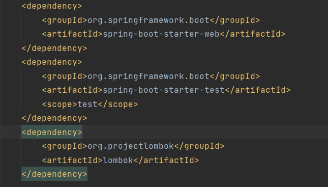
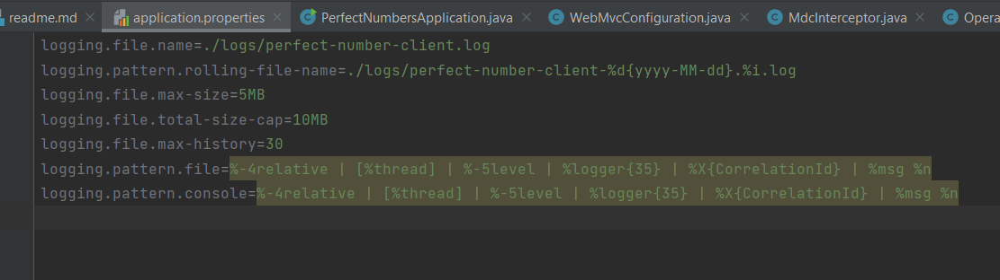
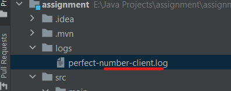
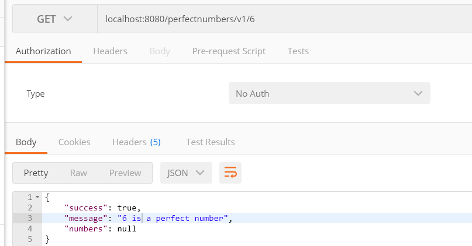
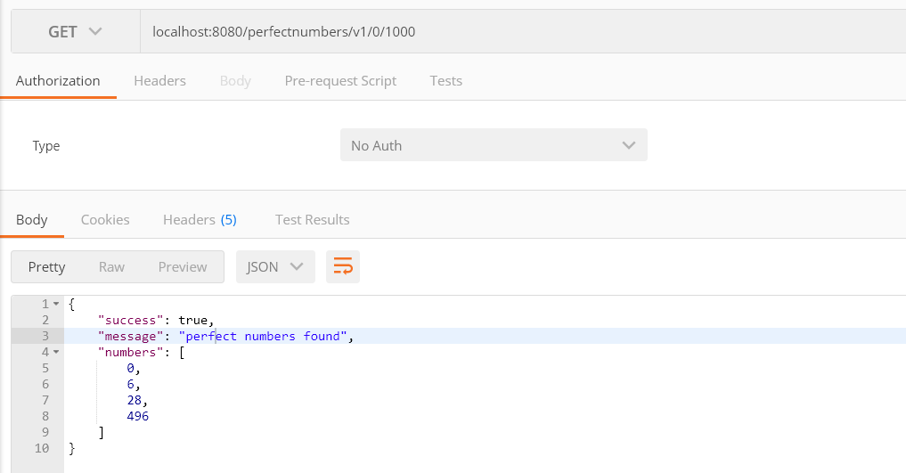
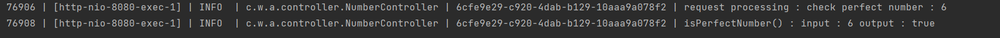
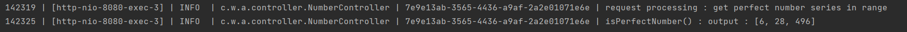

Java 11 and Spring Boot is used for this project 
dependencies used as follows 

for the logging Sl4J is used and logs copied to the logs folder with below properties 

The postman test results screens as follows

Here are the logged requests and responses with the correlation id which is 
embedded by using the interceptors. correlation id is important when working with the
multiple threads with high range of requests.

